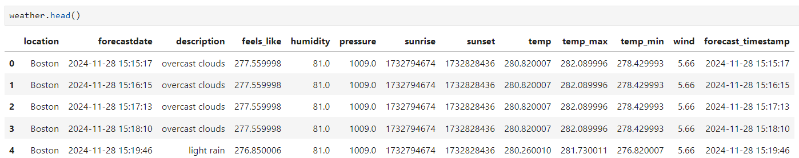
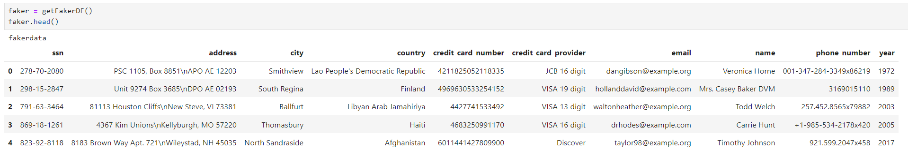
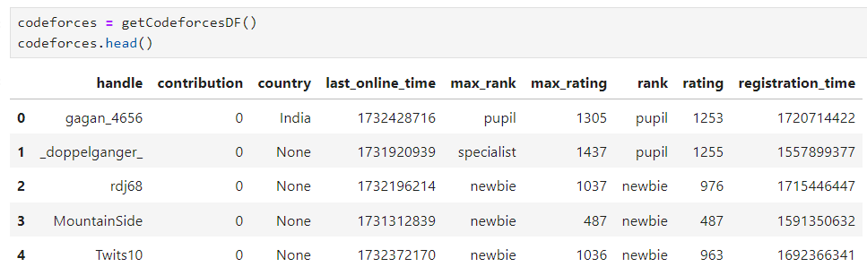
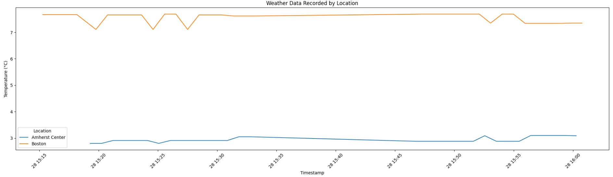
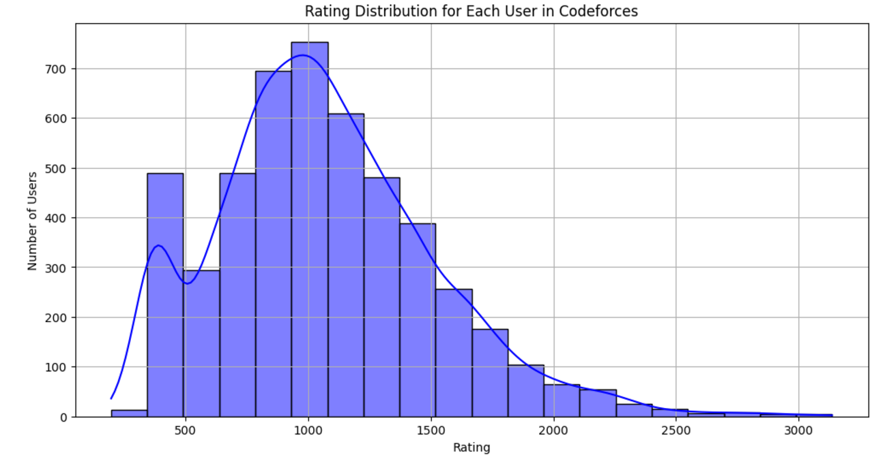
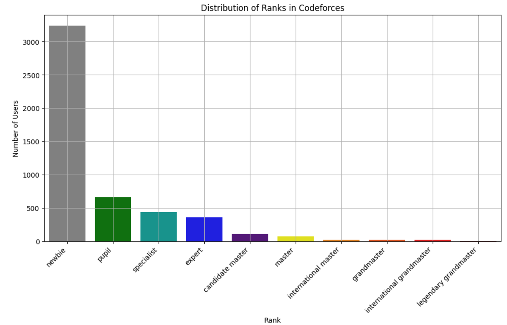

# Quickstart instructions

## API Keys 
| API Keys                  | Documentation       |
|---------------------------|----------------------|
| **OpenWeatherMap API**    |    https://openweathermap.org/api       |
| **Faker API**             | https://faker.readthedocs.io/en/master  |
| **Codeforces API**        | https://codeforces.com/apiHelp          |

You need to apply for some APIs to use with this. The APIs might take days for application to be granted access. Sample API keys are given, but it can be blocked if too many users are running this.

To use the **OpenWeatherMap API**, please go the website, obtain the API key and  update the file "owm-producer/openweathermap_service.cfg".

## Create docker networks
```bash
$ docker network create kafka-network                         # create a new docker network for kafka cluster (zookeeper, broker, kafka-manager services, and kafka connect sink services)
$ docker network create cassandra-network                     # create a new docker network for cassandra. (kafka connect will exist on this network as well in addition to kafka-network)
```
## Starting Cassandra

Cassandra is setup so it runs keyspace and schema creation scripts at first setup so it is ready to use.
```bash
$ docker-compose -f cassandra/docker-compose.yml up -d
```

## Starting Kafka on Docker
```bash
$ docker-compose -f kafka/docker-compose.yml up -d            # start single zookeeper, broker, kafka-manager and kafka-connect services
$ docker ps -a                                                # sanity check to make sure services are up: kafka_broker_1, kafka-manager, zookeeper, kafka-connect service
```

> **Note:** 
Kafka-Manager front end is available at http://localhost:9000

You can use it to create cluster to view the topics streaming in Kafka.


**IMPORTANT**: To start the cassandra sinks, manually go the CLI of the "kafka-connect" container and run the below comment:
```
./start-and-wait.sh
```

## Starting Producers
```bash
$ docker-compose -f owm-producer/docker-compose.yml up -d     # start the producer that retrieves open weather map
$ docker-compose -f faker-producer/docker-compose.yml up -d # start the producer for faker
$ docker-compose -f codeforces-producer/docker-compose.yml up -d # start the producer for codeforces
```

## Starting Consumers (optional)

The consumers container is used to consume the data produced by the producers and write it to Cassandra. You can check if the producer is working by checking the logs of the consumer container. 

```bash
$ docker-compose -f consumer/docker-compose.yml up -d         # start the consumer
```

## Check that data is arriving to Cassandra

First login into Cassandra's container with the following command or open a new CLI from Docker Desktop if you use that.
```bash
$ docker exec -it cassandra bash
```
Once loged in, bring up cqlsh with this command and query weatherreport, fakerdata and codeforcesdata tables like this:
```bash
$ cqlsh --cqlversion=3.4.4 127.0.0.1 #make sure you use the correct cqlversion

cqlsh> use kafkapipeline; #keyspace name

cqlsh:kafkapipeline> select * from fakerdata;

cqlsh:kafkapipeline> select * from weatherreport;

cqlsh:kafkapipeline> select * from codeforcesdata;
```

And that's it! you should be seeing records coming in to Cassandra. 

## Codeforces API (Task 3)

The Codeforces API is a RESTful API that allows users to access data from the Codeforces platform. The API provides access to data such as user information, contest information, user rating, ranks, and problem information. The API is free to use and does not require an API key.

For more information on the Codeforces API, please refer to the official documentation: https://codeforces.com/apiHelp

## Visualization

Run the following command the go to http://localhost:8888 and run the visualization notebook accordingly

```
docker-compose -f data-vis/docker-compose.yml up -d
```

**Note**: When log in the at the fist time, the jupyter notebook might require a token to log in. The token is `EEET2574` which is configured in the `--NotebookApp.token` variable in the `data-vis/Dockerfile` file.

Once logged in, getting the data from weatherreport, fakerdata and codeforcesdata tables with these commands:
```bash
weather = getWeatherDF() # Get the weather data
 
faker = getFakerDF() # Get the faker data

codeforces = getCodeforcesDF() # Get the codeforces data
```

Below are some examples of the weather, faker and codeforces data:
#### Weather data

#### Faker data

#### Codeforces data


### Plot
In this section, we will use **weather** and **codeforces** data for visualizations.

### Weather Data

In the weather data, we will retrieve the weather information at 2 cities: **Boston** and **New York**.

#### Weather Data Recorded By Location in Celcius



From the above graph, we can see that:
- **Amherst Center**: The temperature remains consistently low, around 3°C throughout the time series, indicating colder conditions compared to Boston.
- **Boston**: The temperature starts at around 8°C and flutuates around 7-8°C before remaining steady at 8°C throughout the observation period.

### Codeforces Data

In the Codefores data, we will retrieve a list of users who participate in at least one contests in Codeforces in the last month.

#### Rating Distribution in Codeforces


The above graph illusatrate the distribution of the rating of the users in Codeforces. 

The `x-axis` represents the rating of the users while the `y-axis` reflects the number of users with that rating. 

Looking at the above graph, we can see that the distribution is right-skewed, with the majority of users cluster around lower ratings. The most prominent peak in the graph above occurs at around rating **1000-1200**, indicating most of the users fall within this rating. 
Beyond the rating **2000**, there is a common trend that when the ratings increase, the number of users decreases significantly, implying that higher ratings are achieved by a small fraction of participants. 

#### Ranks Distribution in Codeforces


The above graph illusatrate the distribution of the ranks among Codeforces users. 
Most of the users fall within the `newbie` rank, observing over 3000 particicipants. Moving to higher ranks, the number of users with corresponding ranks descrease significantly. In details, following `newbie`, the next 3 most common ranks are `pupil`, `specialist` and `expert`, achieving apporximately 600, 400 and 300, respectively. In higher ranks (`candidate master`, `master` and beyond), only a small fraction of users meet these requirements, which is less than 100. 

## Practical Implication of the Project 
Reflect on the practical value of your project, including description of the user case and 
scenario, and how your approach can help solve the problem described in the scenario. 

**1. Weather Forecast** 

The OpenWeatherMap API is useful for knowing the information of weather forecast. Some of the use cases:
- A travel agency can rely on the weather forecast to provide the best travel advice to their customers.
- Organizations hosting outdoor activites such as trekking or cycling events might need the weather forecast to make the detailed plans.
  
As a result, by using the OpenWeatherMap API, the organization or individuals can determine the weather conditions, which will help them make better decisions, give their customers better services, and improve event logistics.

**2. Faker Data** 

The Faker API is useful for generating mock data for testing and development purposes. Some of the use cases:
- Software testers can employ the Faker API to generate fake data to test their applications.
- Data scientists or AI engineers can generate fake data using the Faker API to train their AI/machine learning models.
  
As a result, by utilizing the Faker API, users can simulate a large number of data without relying on real data, thus ensure the system is tested thoroughly while maintaining data privacy and security during development as well as robust and efficient trained models.

**3. Codeforces Data** 

Data from the Codeforces platform can be accessed with the help of the Codeforces API. Some of the use cases:
- Competitive programmers can use the Codeforces API to access contest information, user rating, ranks, and problem information.
  
Therefore, by using the Codeforces API, individuals can customize their training process and focus on their weak areas to improve their competitive programming skills.
